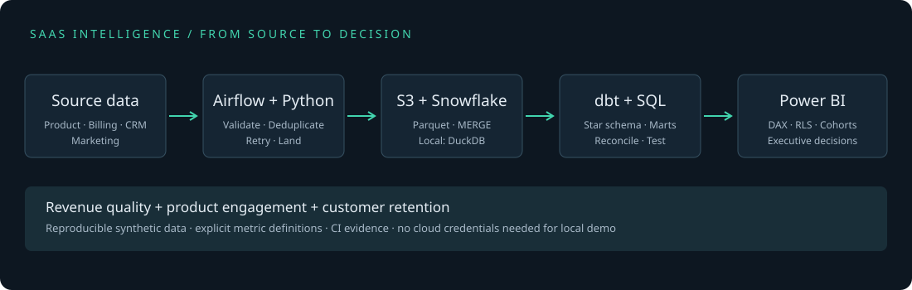

# SaaS Revenue & Product Intelligence

[](https://github.com/nawyaunnam/saas-revenue-product-intelligence/actions/workflows/ci.yml)


An end-to-end analytics portfolio project that connects **revenue performance to product behavior**. Python validates billing, CRM, product and marketing data; Airflow orchestrates the pipeline; S3 and Snowflake provide the cloud path; dbt builds a tested star schema; Power BI provides the executive semantic model and report source.

A credential-free DuckDB path executes the same dbt models locally and in CI. All included data is synthetic.



## Run it

```bash
git clone https://github.com/nawyaunnam/saas-revenue-product-intelligence.git
cd saas-revenue-product-intelligence
python3.12 -m venv .venv
source .venv/bin/activate
pip install -e '.[dev]'
saas demo
python -m http.server 8081 --directory artifacts
```

Open **http://localhost:8081/dashboard.html**. Or use `docker compose up --build pipeline preview`.

The default sample produces **120 accounts, 70,090 deduplicated events and 18 months** of activity. June 2025 sample MRR is **$68,004.25**, ARR **$816,051**, and MAU **379**. These are reproducible synthetic results, not business performance claims. [Inspect the sample summary](docs/demo/summary.json) or download/open [the self-contained HTML preview](docs/demo/dashboard.html).

## What you can investigate

- **Revenue quality:** MRR/ARR, new business, expansion, contraction, churn, reactivation, NRR and GRR, with an exact opening-to-closing bridge.
- **Product engagement:** distinct-user DAU/MAU, stickiness, seven-day activation, feature adoption and account cohort retention.
- **Acquisition:** signup → qualification → paid funnels, marketing cost by channel, conversion and cohort acquisition cost.
- **Customer value:** ARPA and clearly labeled modeled LTV; SQL investigations into expansion drivers and declining usage.

[Metric definitions and grains](docs/metrics.md) explain denominator choices, observation windows and limitations. The golden finance fixture verifies NRR excludes new revenue and annual billing normalizes correctly.

## Power BI deliverable

Open [powerbi/SaaSIntelligence.pbip](powerbi/SaaSIntelligence.pbip) in Power BI Desktop on Windows. Set DataFolder, refresh the exported CSVs, or switch the M parameters to Snowflake.

The project includes six report pages, DAX measures, Power Query/M, one-way star-schema relationships, a period calculation group, metric field parameter, account drill-through, navigation bookmarks, dynamic revenue tooltip and regional RLS. An opt-in Snowflake incremental refresh policy and performance-validation workflow are also included.

**Validation boundary:** CI validates PBIR JSON against official Microsoft schemas and deserializes the semantic model using Microsoft TOM. Power BI Desktop rendering, DAX execution, Service RLS and refresh require the documented Windows/cloud acceptance checks. [Power BI setup and checklist](powerbi/README.md).

## Engineering depth

| Layer | Implementation |
|---|---|
| Ingestion | Typed contracts, foreign-key/chronology checks, latest-arrival event deduplication, immutable Parquet, SHA256 manifests |
| Storage | Atomic DuckDB raw loads locally; encrypted S3 upload plus Snowflake staging/MERGE and batch audit in cloud |
| Transformation | 19 dbt models across staging, intermediate and marts, finance reconciliation and dimensional tests |
| Orchestration | Airflow 3 DAG, bounded retries, task timeout, single active run, tested DAG parsing |
| Analytics | Window functions, date spines, conditional aggregation, lagged behavior and cohort analysis |
| BI governance | Explicit measures, regional entitlement mapping, no disconnected aggregate RLS leaks, query-folding checks |
| Delivery | Docker, Compose, GitHub Actions, synthetic result artifacts, metric contract documentation |

## Verification

```bash
ruff check src tests dags scripts
pytest -q
saas demo  # dbt build runs its model and data tests
DUCKDB_PATH="$PWD/data/warehouse.duckdb" dbt docs generate --project-dir dbt --profiles-dir dbt
```

CI runs Python/golden-metric tests, report schemas, an entire sample build, the pipeline container, Airflow DAG parsing in its real runtime, and Microsoft TOM metadata validation. Download the `analytics-evidence` artifact for CSV outputs, dashboard, dbt catalog, lineage and run results.

## Repository map

```text
src/saas_intelligence/  generation, validation, load, export, cloud adapter, CLI
dags/                  Airflow orchestration
dbt/                   source definitions, dimensions, facts, marts, data tests
warehouse/             Snowflake provisioning SQL
sql/                   analyst investigations
powerbi/               PBIP + PBIR + model.bim + DAX + refresh policy
tests/                 ingestion, golden metrics, model/report validation
docs/                  architecture, contracts, deployment, sample preview
```

Start with [deployment](docs/deployment.md), [architecture](docs/architecture.md), and [metric contracts](docs/metrics.md).

**Scope:** extraction uses a seeded generator, not live Stripe/Salesforce connectors. The cloud adapter requires your Snowflake/AWS configuration and has not been run against a live account. Marts rebuild the bounded dataset to handle historical corrections correctly. Production incremental CDC, SCD2 history, enterprise alert routing and HA Airflow are documented extension points, not claimed implementations.

MIT licensed. Third-party report schemas retain Microsoft's license.
