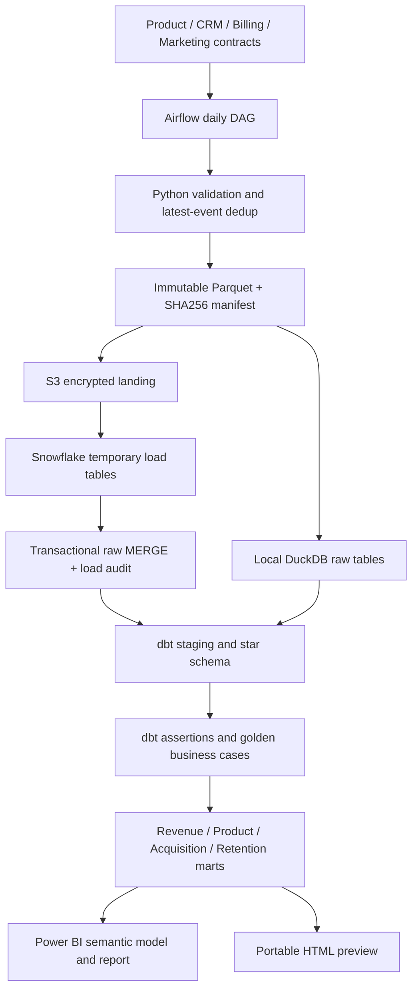

# Architecture and operating boundaries

The included extraction source is a seeded synthetic generator; it is not a live Stripe, Salesforce, or marketing connector. Typed contracts expose the adapter boundary. Full batches validate before landing. On validation failure no data files are published. Deterministic Parquet hashes make identical replay use the same batch ID. The manifest is written last on S3. Local raw replacement is atomic in one transaction. Snowflake loads temporary tables before a multi-table MERGE transaction and records successful batch IDs.

Airflow chains validation/landing, load, `dbt build`, then BI exports. Tasks retry twice, have time limits, and prohibit concurrent DAG runs. Cloud MERGE retains absent records; local demo uses full snapshot replacement. Sources must explicitly send zero subscription balances for cancellation. Old subscription snapshot corrections must arrive in ordered batches: unlike events, billing has no source-version column in this sample.

The bounded demo rebuilds marts, so late events and historical corrections are incorporated without a lossy high-water mark. For larger data, add partition-aware change tracking and explicit restatement windows before converting dbt facts to incremental materializations. The Power BI Snowflake incremental policy refreshes the last seven days; older corrections require partition refreshes or a full refresh. These are different layers.

Observability: Airflow task states/logs and retry history, raw manifests and row counts, Snowflake LOAD_AUDIT, dbt manifest/run_results, CI artifacts and explicit finance reconciliation. No external telemetry service is silently enabled. Seeded data is synthetic and safe to publish; actual landing files, warehouse databases and secrets are gitignored.

This is a working portfolio reference, not a claim of production scale. Cloud costs, least-privilege service users, alert routing, data residency and source SLAs need environment-specific configuration before deployment.
